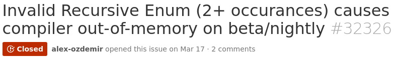

layout: true
class: center middle

---

## Memory Safety

### Ownership II

1 November 2016

---

layout: false
class: left

## Administrivia

   * Grading
      * To get full marks
         * Do all assignments, your presentation, and the final project
         * Also do 2 bonuses (possibly in the same week)
      * OR put in the requisite (8 - 1.5) hours
   * Late policy
      * Everyone gets a euro -- good for getting 1 assignment in up to 1 day
        late without penalty.
      * Otherwise, late assignments receive a penalty commensurate with 1 bonus
        each day.
      * If you're in a sticky situation, talk to me -- I'm happy to grant an
        extension

---

layout: false
class: left

## Outline of today

   1. Assignment Debrief
      * Sample solution
      * `while let`, `if let`
   2. Tree Rotation Exercise
      * `box` syntax
      * Tree representation
      * Rotations exercise
      * Application of `box` syntax:
         * Boxes and partial moves.
   3. Assignment Brief
      * Project Structure
      * Macros
   4. Implications of Ownership
      * Data Races!
      * `Send`, `Sync`

---

class: center middle

## Assignment Debreif

--

First of all, nice work!

--

Biggest room for improvement: _using Rust idioms_.


---

## Idioms Exercise

Grab a partner and go here: [https://is.gd/D580oW](https://is.gd/D580oW).

---

## While-Let

Consider this code:

```rust
impl<T> SinglyLinkList<T> {
   fn reverse(&mut self) {
      let mut list = SinglyLinkedList::<T>::new();

      loop {
         match self.head {
            Some(_) => list.push_front(self.pop_front().unwrap()),
            None => break
         }
      }

      mem::swap(&mut self.head, &mut list.head);
   }
}
```

Can we eliminate the `unwrap`?

---

## While-Let

We can match on the result of `pop_front` to eliminate the `unwrap`!

```rust
impl<T> SinglyLinkList<T> {
   fn reverse(&mut self) {
      let mut list = SinglyLinkedList::<T>::new();

      loop {
         match self.pop_front() {
            Some(item) => list.push_front(item),
            None => break
         }
      }

      mem::swap(&mut self.head, &mut list.head);
   }
}
```

Is there a good way to say "loop until this thing is `None`"?

---

## While-Let

While-Let allows us to express "loop while this expression matches this
pattern":

```rust
impl<T> SinglyLinkList<T> {
   fn reverse(&mut self) {
      let mut list = SinglyLinkedList::<T>::new();

      while let Some(item) = self.pop_front() {
         list.push_front(item);
      }

      mem::swap(&mut self.head, &mut list.head);
   }
}
```

If-Let works similarly ("If this expression matches this pattern, then ... ,
else ...").

---

## Writing Idiomatic Code

The best way to write more idiomatic code is to _read_ idiomatic code.

To that end, I strongly recommend you check out the sample solution, which is
the `solution` branch in the starter code's repository.

---

class: center, middle

## Tree Rotations

---

## Binary Trees in Rust

How should we represent a binary tree?

--

How about this?

```rust
enum Tree<T> {
   data: T,
   left: Option<Tree<T>>,
   right: Option<Tree<T>>,
}
```

--

Not quite:

```
error[E0072]: recursive type `Tree` has infinite size
```

--

Once upon a time the error was not as nice:



---

## Binary Trees in Rust

A better representation:

```rust
enum Tree<T> {
   data: T,
   left: Option<Box<Tree<T>>>,
   right: Option<Box<Tree<T>>>,
}
```

--

An alternative representation:

```rust
enum Tree<T> {
    Leaf(T),
    Fork(Box<Tree<T>>, T, Box<Tree<T>>),
}
```

---

## Exercise: Tree Rotations

Binary trees can be rotated:


Go [here][rotation-exercise] to implement left-rotation!

`box` syntax and patterns (available on nightly) may be useful:

```rust
let x: Box<i32> = box 5;
let box y = x;
// y is an i32
```

---

class: center, middle

## Assignment Briefing

---

## Project Structure

For the last assignment you were able to to run `cargo test` in order to test
your code.

This command assumes your project is structured in a certain way.

Part of Rust project structure is specified by the language (enforced by
`rustc`). The rest is specified by Rust's build tool / package manner, `cargo`.

Let's start with the part built into the language. This is the module system.

---

## Project Structure: Modules

A Rust program or library consists of a tree of modules.

These modules serve two purposes:

   1. Creating privacy barriers
   1. Allowing code to be organized across a filesystem

---

## Modules: Privacy

```rust
mod a {
   pub use self::b::inc;
   mod b {
      pub fn inc(x: i32) -> i32 { x + 1 }
      pub fn plus_two(x: i32) -> i32 { x + 2 }
      fn plus_three(x: i32) -> i32 { x + 3 }
   }
   pub mod c {
      pub fn plus_four(x: i32) -> i32 { x + 4 }
   }
}
```

Because `inc` is `pub`, it is visible in module `a` by name `b::inc`.

Question: Which functions are visible in modules a, b, c, and the root module of
the file? What names may be used to identify them?

---

## Modules: Privacy

```rust
mod a {
   pub use self::b::inc;
   mod b {
      pub fn inc(x: i32) -> i32 { x + 1 }
      pub fn plus_two(x: i32) -> i32 { x + 2 }
      fn plus_three(x: i32) -> i32 { x + 3 }
   }
   pub mod c {
      pub fn plus_four(x: i32) -> i32 { x + 4 }
   }
}
```

Answers:

   * root: a::inc, a::c::plus_four
   * a: inc, b::inc, b::plus_two, c::plus_four
   * b: inc, plus_two, plus_three
   * c: plus_four


---

## Modules: Filesystem Interactions

We've seen how `mod a { ... }` makes a module `a` with contents `...`.

The following is also valid: `mod a;`. It does one of two things:

   1. Takes the contents of `a.rs` (in the same directory) and makes a module
      `a` around them.
   2. Takes the contents of `a/mod.rs` and makes a module `a` around them.


This allows for code to be distributed across different files

```
src/
   main.rs
   cli.rs
   list/
      mod.rs
      iter.rs
```

```
rustc src/main.rs
```

---

## Project Structure: Cargo

So far we've looked at how Rust determines project structure using _modules_.

Rust's build tool and dependency manager, `cargo` also influences project
structure.

It does this by choosing which file to run `rustc` on*. By default it looks for
`src/main.rs` or `src/lib.rs`. It can de directed to look elsewhere.

---

## Cargo.toml Example

```
[package]
name = "wk2-starter"
version = "0.1.0"
authors = ["Alex Ozdemir <aozdemir@hmc.edu>"]

[dependencies]
nom = "^1.2.4"

[[bin]]                     // Defines a binary
name = "repl"               // named repl
path = "src/repl.rs"        // with main fn in src/repl.rs.
                            // Build with `cargo build --bin repl`
                            // Run   with `cargo test  --bin repl`
                            // There can be multiple binaries
```

---

class: center, middle

## Macros

---

## Macros So Far...

We've been using a number of simple (but useful macros).

```rust
try!(/* expre */);
println!("{:?}", x);
unimplemented!();
unreachable!();
assert_eq!(5, 5);
```

Macros can get _much_ more sophisticated, as hinted at by:

```rust
println!("{}", 5, 6);
```

---

## Exciting Macros

This is an example macro invocation from the library we'll be using this week.
It declares a parser which parses a factor (an i64).

```rust
named!(factor<i64>,// <i64> used to specify parser 'return' type
  alt!(            // , used to separate name from specification
    i64_digit
  | parens         // | used to indicate alternatives (it's a
  )                //   digit or a parenthesized expression)
);
```

---

## The Assignment

This week you'll be using `nom`, a parser combinator library that uses macros to
declare parsers.

You'll be turning it's canonical example (a parser that 'parses' an expression
into its value) into a parser that parses an expression into a tree.

While this doesn't sound like it would raise memory issues, it will raise a few,
and this assignment is about noticing them when they happen and reacting
accordingly.

_Debugging will be painful: Rust handles error messages related to macros
better than many languages, but it's still pretty rough._

---

class: center, middle
_two minute break_

---

class: center, middle

## Ownership and Concurrency

---

## The Ownership System

Recall that the Rust ownership system (enforced by `borrowck`):

   1. Requires all data have a unique owner.
   1. Requires no reference outlives its referent.
   1. Prohibits simultaneous aliasing and mutation.

_Also recall that we've yet to give a precise definition of **simultaneous** or
**outlives**._

--

The ownership system naturally gives rise to nice concurrency properties.
Specifically, Rust guarantees that no _data races_ will occur.

---

## Data Races

What is a data race? A situation in which the output of a program depends on
which thread accesses data first. An example:

```rust
use std::thread;
let x = 0;
for i in 0..100 {
    thread::spawn(|| {
        x += 1;
    });
}
```

Why is this a race condition?

Does it compile?

???

Lifetimes 101.

---

## Data Races

How does the compiler know that the closure may outlive the current function?

The answer lies in the documentation for `thread::spawn`,
[here](https://doc.rust-lang.org/std/thread/fn.spawn.html).

---

## Data Races: Summary

   * For a function (or closure) to be executed in another thread, that closure
     must be callable for a _very long time_.
      * Specifically, it must outlive (or equal) `'static`, the lifetime of the program.
   * This effectively prohibits one thread writing to a location while another
     thread reads it.
      * Consider: we want to spawn a thread `A` which will write to `x` while we
        read from `x`. Options (they ultimately don't work -- why?)
         1. We move `x` into `A`, then try to read it
         2. We make a reference to `x`, then try to move it into `A`
         3. We give `A` a mutable reference, then try to read `x`.
         4. We make a reference to `x`, then try to give `A` a mutable
            reference.

---

## Remaining Questions

We still haven't provided precise definitions for the terms *outlives* and
*simultaneous* as used by the ownership system.

--

We have, however, bumped into some of the syntax used to talk about such things.
We saw that for a function `F` to be callable in another thread, `F` must
satisfy:

```
   F: 'static
```

which means that `F` must 'outlive' `'static` where `'static` is the lifetime of
the entire program.

--

Next time we'll develop this idea of a lifetime more fully.

[rotation-exercise]: https://is.gd/7SVcoI
